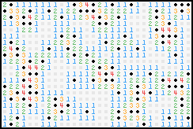

# 4KGBA

A collection of small Gameboy Advance demos whose exported ROMs occupy 4096
bytes or less.

## Project Specifications

- ROM size no more than 4096 Bytes
- Implementation in a single readable C-file 500 lines or less
- Short Makefile using DevKitPro to compile, link and patch
- No dependencies apart from macros and BIOS calls in libadvance

## Libadvance

Libadvance is a stripped-down refactored copy of tonclib designed specifically
for 4KGBA. Features are to be implemented only as needed by 4KGBA projects.
Macros and BIOS calls only, all other features must be implemented on a
per-project basis.

## Download the ROMs

[**minesweeper.gba (3984 bytes)**][minesweeper release]  

## Attributions

**Tonclib Code**  
© 2005-2009 Jasper Vijn  
Licensed under MIT

**4KGBA Code**  
© 2019 Lucas Towers  
Licensed under MIT

[minesweeper release]: https://github.com/luctowers/4kgba/releases/download/0.0.1/minesweeper.gba